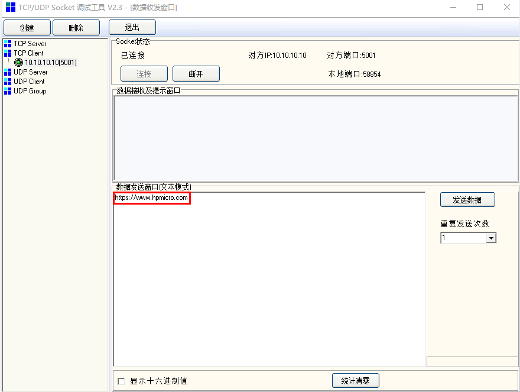
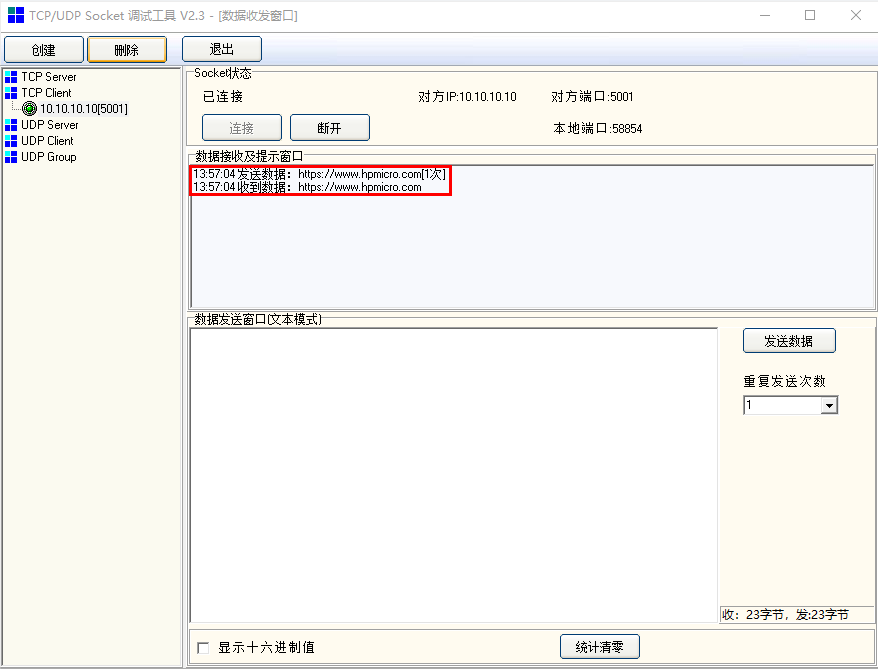

# TCP Echo

## Overview

This  example shows TCP echo communication.

- PC sends TCP data frames to MCU,  and then MCU sends the data frames back to PC

## Board Setting

- Connect a USB port on PC to the PWR DEBUG port on the development board with a USB Type-C cable
- Connect an Ethernet port on PC to a RGMII port or a RMII port on the development board with an Ethernet cable

## Project Configuration

- In the file `CMakelists.txt` ,  set a matched Ethernet PHY type according to the development board schematic，

  e.g. "set(COFNIG_ENET_PHY_DP83848 1)"

## Run Example

- Compiling and Downloading
- Running log is shown in the serial terminal as follows:

     ```console
     This is an ethernet demo: TCP Echo (Polling Usage)
     LwIP Version: 2.1.2
     Reference Clock: Internal Clock
     Enet phy init passes !
     Static IP: 10.10.10.10
     NETMASK  : 255.255.255.0
     Gateway  : 10.10.10.1
     Link Status: Up
     Link Speed:  100Mbps
     Link Duplex: Full duplex
     ```

- Run an Ethernet debugging tool

  - create and set a TCP client:  TCP Server IP: 10.10.10.10/Port: 5001

    **Note: There is a necessary adjustment for Server IP according to the segment of  LAN where PC resides**

  - Connect

  - Enter and send any characters in the edit window

    
  
  - Watch the characters echoed from MCU
  
    
